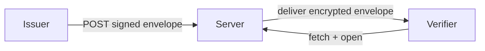

# Data Wallet

Data Wallet is a system for end-to-end-encrypted, issuer-signed envelope storage and delivery: an issuer signs and encrypts a payload, uploads it to the server, and a verifier fetches and opens it — the server never sees the plaintext.
The stack is a Spring Boot server, a Flutter verifier client, and a Java CLI for scripted issuer and verifier workflows.
Trust is anchored by a pinned root key and a directory of signed issuer and verifier identities, so the server cannot forge or substitute payloads even if fully compromised.

> **Diagram:** the three actors and what flows between them.

## Where to go next

- **Just want to know what this is?** Read on — three more paragraphs below.
- **Want to run it locally?** → [how-to/run-locally.md](how-to/run-locally.md)
- **Want to understand the architecture?** → [explanation/architecture.md](explanation/architecture.md)
- **Adding a feature?** → [tutorials/first-share.md](tutorials/first-share.md)
- **Reviewing for security?** → [reference/audiences/security-reviewer.md](reference/audiences/security-reviewer.md)
- **Looking for the wire-format spec?** → [`specs/api.md`](specs/api.md), [`specs/crypto-formats.md`](specs/crypto-formats.md)

## What problem this solves

An issuer — a credentialing authority, an employer, a government agency — wants to share a cryptographically signed payload with a specific verifier without handing the server a decryption key.
Today the common alternative is either email attachments (no integrity) or a trusted third-party vault (the vault operator becomes an attack surface).
Data Wallet removes the server from the trust equation: the envelope is signed by the issuer's key and encrypted for the verifier's public key before it leaves the issuer's machine, so a compromised server can delay or drop delivery but cannot read or forge a payload.

## The role of the directory and root quorum

Every issuer and verifier identity is recorded in a directory: a signed, append-only log of public keys.
The directory itself is signed by a root key whose public half is pinned in the client at build time; a quorum of root key holders must approve any change to the directory.
This means the server cannot silently swap an issuer's signing key or a verifier's encryption key — a client that checks the directory will detect the substitution before opening any envelope.

## Where to go deeper

The full design rationale, threat model, and lifecycle are in [`specs/plan.md`](specs/plan.md).
The byte-level wire formats are in [`specs/crypto-formats.md`](specs/crypto-formats.md) and [`specs/api.md`](specs/api.md).
Those files are the authoritative source of truth; every page in `docs/` links to them rather than paraphrasing them.
