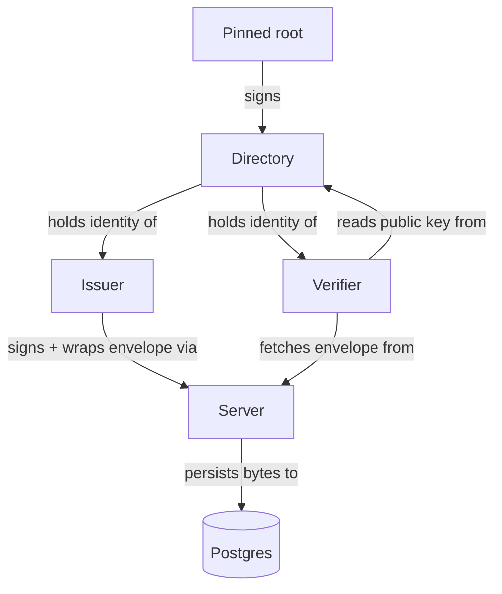

# Architecture

Data Wallet is an end-to-end-encrypted, issuer-signed envelope delivery
system. An issuer signs and encrypts a payload for a named verifier; the
server stores and routes the opaque bytes; the verifier fetches and decrypts
them. Neither the server nor any passive observer can read the plaintext — the
content key is wrapped exclusively to the verifier's X25519 public key.

---

The diagram below shows the actors and the trust relationships between them.

## Actors

### Issuer

The issuer creates envelopes and uploads them to the server. In this
implementation the issuer is the Java CLI (entry point:
[`cli/`](../../src/main/java/com/wilhelmsen/cbslink/plugin/datawallet/cli/)).
In production the issuer authenticates via mutual TLS; the server resolves
the issuer identity through
[`security/IssuerPrincipalResolver.java`](../../src/main/java/com/wilhelmsen/cbslink/plugin/datawallet/security/IssuerPrincipalResolver.java)
(interface) and
[`security/X509IssuerPrincipalResolver.java`](../../src/main/java/com/wilhelmsen/cbslink/plugin/datawallet/security/X509IssuerPrincipalResolver.java)
(production implementation).

### Verifier

The verifier fetches envelopes addressed to them and decrypts the content
locally. The Flutter client lives under
[`client/lib/src/`](../../client/lib/src/); the Java CLI also implements the
verifier role via
[`cli/VerifierFetchCommand.java`](../../src/main/java/com/wilhelmsen/cbslink/plugin/datawallet/cli/VerifierFetchCommand.java).
The server endpoint the verifier talks to is
[`api/verifier/VerifierController.java`](../../src/main/java/com/wilhelmsen/cbslink/plugin/datawallet/api/verifier/VerifierController.java).

### Server

The server is a Spring Boot application. It authenticates callers, validates
envelope signatures against the directory, and persists the opaque CBOR bytes.
It never decrypts content. All HTTP controllers live under
[`api/`](../../src/main/java/com/wilhelmsen/cbslink/plugin/datawallet/api/).

### Directory and pinned root

The directory holds signed records for every issuer and verifier. Records are
signed by the root keypair; the server verifies all directory entries against
the pinned root before accepting them. The directory logic lives in
[`directory/`](../../src/main/java/com/wilhelmsen/cbslink/plugin/datawallet/directory/);
the schema is established in migration
[`V1__init.sql`](../../src/main/resources/db/migration/V1__init.sql) and the
pinned-root history table is added in
[`V7__pinned_root_history.sql`](../../src/main/resources/db/migration/V7__pinned_root_history.sql).

## Trust boundaries

The server is trusted to store and route bytes faithfully and to enforce
access control (bearer-token auth, rate limiting, audit logging). The server
is **not** trusted with plaintext: it cannot read envelope content, cannot
mint directory entries (only the offline root quorum can sign them), and
cannot impersonate an issuer or verifier. The audit hash chain
([`audit/HashChainAuditService.java`](../../src/main/java/com/wilhelmsen/cbslink/plugin/datawallet/audit/HashChainAuditService.java))
records every share event in a tamper-evident log, but even a compromised
server cannot retroactively decrypt historical envelopes. For the full threat
model see [`trust-model.md`](trust-model.md).

## Operational surface

**Database roles.** Postgres uses two roles: `wallet_app` for DML (all
application queries at runtime) and `wallet_admin` for migrations and admin
reads. Application code never holds `wallet_admin` credentials; they are used
only by Flyway at startup and by admin tooling.

**Authentication.** Verifiers authenticate with opaque 32-byte bearer tokens
issued after a challenge / response exchange. There are no cookies, no CSRF
surface, and no refresh tokens — re-login is the recovery path. Issuers
authenticate via mutual TLS in production.

## Out of scope

OPAQUE/aPAKE login, password recovery, refresh tokens, multi-active auth keys
per verifier, WebSocket push, streaming uploads, FROST/MuSig2, TLS
channel-binding of session tokens, per-column TDE, off-heap/`mlock` buffers,
server-side search/filter beyond `since`+cursor, mixed-script Unicode handles,
audit-anchor external publication, multi-module Maven split, dedicated issuer
Flutter app, web client UX polish.

See [`specs/plan.md`](../specs/plan.md) "Out of Scope" for rationale.

## See also

- [`trust-model.md`](trust-model.md) — root-to-verifier trust chain in detail
- [`envelope-lifecycle.md`](envelope-lifecycle.md) — build → sign → wrap → upload → fetch → open
- [`specs/plan.md`](../specs/plan.md) — design rationale and threat model
