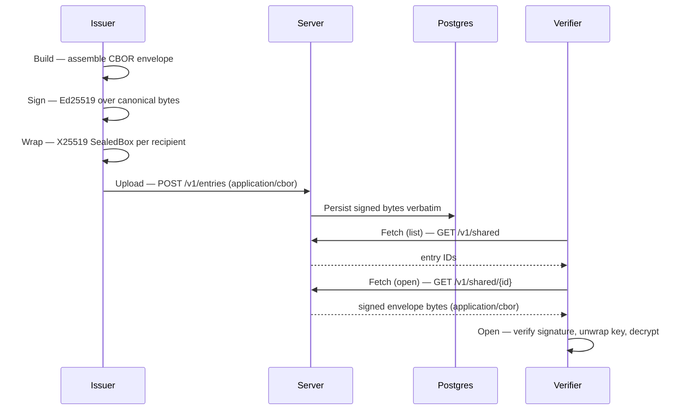

# Envelope lifecycle

An envelope passes through six phases: build, sign, wrap, upload, fetch, open.
The canonical-bytes invariant holds across all of them: the bytes the issuer
signs are identical to the bytes the server stores in the `BYTEA` column, which
are identical to the bytes the verifier receives over the wire and verifies.
The server never re-serializes a signed payload — if it did, the signature
would be invalid at the verifier.

The sequence diagram below shows the roles involved in each phase. Issuer
and Verifier are logical roles; each can be the Java CLI or the Flutter client.

## Phases

### Build

The issuer assembles the envelope structure: plaintext encrypted with a random
content key, metadata (description, timestamp, recipient list), and the
wrapped-key blobs. The codec lives in
[`envelope/`](../../src/main/java/com/erikromson/datawallet/envelope/),
with the Flutter equivalent at
[`client/lib/src/envelope/`](../../client/lib/src/envelope/).

### Sign

The issuer serializes the envelope to canonical CBOR and signs the resulting
bytes with the issuer's Ed25519 private key. The signing logic is in
[`envelope/EnvelopeSigner.java`](../../src/main/java/com/erikromson/datawallet/envelope/EnvelopeSigner.java),
backed by
[`crypto/Ed25519.java`](../../src/main/java/com/erikromson/datawallet/crypto/Ed25519.java).
The key itself comes from the issuer's directory record.

### Wrap

A random content key encrypts the plaintext (SecretBox). That content key is
then sealed separately for each recipient using X25519 SealedBox, keyed to the
recipient's public key from the directory. Wrapping uses
[`crypto/SealedBox.java`](../../src/main/java/com/erikromson/datawallet/crypto/SealedBox.java).
A recipient not listed in the envelope cannot recover the content key.

### Upload

The issuer posts the signed bytes to
[`api/entry/EntryController.java`](../../src/main/java/com/erikromson/datawallet/api/entry/EntryController.java)
as `application/cbor`. The server authenticates the issuer, verifies the
envelope signature against the issuer's directory record, and writes the raw
bytes to Postgres without modification.

### Fetch

The verifier authenticates (opaque 32-byte bearer token), then calls
[`api/shared/SharedController.java`](../../src/main/java/com/erikromson/datawallet/api/shared/SharedController.java)
to list entry IDs visible to them, and then fetches a specific envelope by ID.
The server returns the bytes it stored — no transformation occurs.

### Open

The verifier verifies the Ed25519 signature against the issuer's directory
record, then uses their X25519 private key to unseal the wrapped content key,
then decrypts the ciphertext. In Java this happens in
[`envelope/EnvelopeVerifier.java`](../../src/main/java/com/erikromson/datawallet/envelope/EnvelopeVerifier.java)
and the CLI commands under
[`cli/`](../../src/main/java/com/erikromson/datawallet/cli/).
In Flutter it happens in
[`client/lib/src/envelope/envelope_verifier.dart`](../../client/lib/src/envelope/envelope_verifier.dart).

## Cross-stack invariants

Java and Flutter must produce identical bytes for every fixture — divergence
means either a codec bug or a spec drift. The fixture suite under
[`spec/fixtures/`](../../spec/fixtures/) encodes the expected bytes for every
canonical test case; both stacks run against the same fixtures, enforced in CI.
The fixture catalog is in [`specs/fixtures.md`](../specs/fixtures.md).

## See also

- [`architecture.md`](architecture.md) — actors and trust boundaries
- [`trust-model.md`](trust-model.md) — why signatures and wrapping are structured as they are
- [`specs/crypto-formats.md`](../specs/crypto-formats.md) — byte layouts for each phase
- [`specs/api.md`](../specs/api.md) — wire format for upload and fetch endpoints
