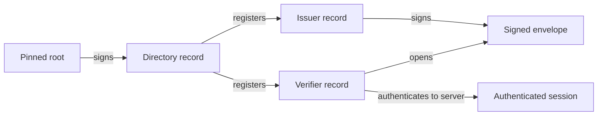

# Trust model

The system is built on a chain of signed assertions. An offline root keypair
signs the directory; the directory holds the Ed25519 signing keys and X25519
encryption keys of every registered issuer and verifier; issuers sign each
envelope with their directory-registered key; verifiers verify that signature
against the directory before accepting plaintext. The server participates only
as a store-and-forward layer — it holds no root secrets and cannot forge any
link in the chain.

The diagram below shows the chain from the pinned root down to a verified
session.

## What the server cannot do

- **Mint a directory entry.** Only the offline root keypair can produce a
  valid root signature. The server stores directory records and verifies them
  against the pinned root
  ([`directory/DirectoryRecordVerifier.java`](../../src/main/java/com/erikromson/datawallet/directory/DirectoryRecordVerifier.java)),
  but it cannot create one. See [`specs/plan.md`](../specs/plan.md) for the
  root-quorum ceremony.

- **Decrypt an envelope.** The content key is sealed with
  [`crypto/SealedBox.java`](../../src/main/java/com/erikromson/datawallet/crypto/SealedBox.java)
  (X25519 SealedBox) to the verifier's public key. The corresponding private
  key never leaves the verifier. The server stores the opaque CBOR bytes only.

- **Impersonate an issuer.** In production the issuer presents a client
  certificate; the server resolves identity through the
  [`security/IssuerPrincipalResolver.java`](../../src/main/java/com/erikromson/datawallet/security/IssuerPrincipalResolver.java)
  interface, backed by
  [`security/X509IssuerPrincipalResolver.java`](../../src/main/java/com/erikromson/datawallet/security/X509IssuerPrincipalResolver.java).
  A certificate the issuer does not hold cannot be forged at the server level.

- **Replay shared entries silently.** Every share event is appended to the
  audit hash chain in
  [`audit/HashChainAuditService.java`](../../src/main/java/com/erikromson/datawallet/audit/HashChainAuditService.java).
  Omitting or reordering entries breaks the chain, which is detectable by an
  external verifier reading the audit log.

## Where the trust comes from

In production the root keypair is held by an offline quorum of operators (see
[`specs/plan.md`](../specs/plan.md) section "Root quorum"). The quorum signs
new directory records out-of-band; the server receives and stores the
pre-signed record. For local development this ceremony is short-circuited by
[`cli/InitDevTrustCommand.java`](../../src/main/java/com/erikromson/datawallet/cli/InitDevTrustCommand.java),
which generates a root keypair and seeds the directory in a single command.
That command must never run against a production database.

## See also

- [`architecture.md`](architecture.md) — actors and operational surface
- [`envelope-lifecycle.md`](envelope-lifecycle.md) — how trust is exercised per envelope
- [`../reference/audiences/security-reviewer.md`](../reference/audiences/security-reviewer.md) — traceable property map for auditors
- [`specs/plan.md`](../specs/plan.md) — full design rationale and threat model
