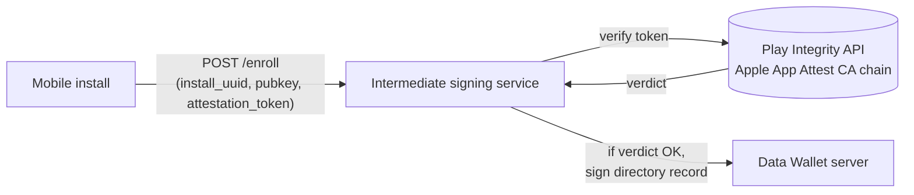

# Further work: app attestation for mobile installs

**Status:** design proposal, not implemented. Deferred from the
per-install mobile-issuers iteration.
**Audience:** anyone planning the iteration that hardens mobile
enrollment against jailbroken / rooted / emulated devices.
**Scope:** how to wire Play Integrity (Android) and App Attest (iOS)
into the intermediate signing service introduced by
[`per-install-mobile-issuers.md`][parent].

[parent]: per-install-mobile-issuers.md

## Why this was deferred

The first iteration of mobile-issuer enrollment ships with a
`StubAttestation` implementation that accepts every enrollment
unconditionally. This is sufficient for:

- Local development.
- Pilot deployments where the user population is trusted (e.g. an
  internal beta).
- End-to-end wiring tests that exercise the full enroll/token/share
  flow without touching real device APIs.

It is **not** sufficient for production deployments where the threat
model includes "user willingly compromises their own device to forge
envelopes from their install". The fix is to plug in real attestation.

The deferral is cheap because the intermediate already presents an
`Attestation` interface (introduced in step 3 of the parent plan) that
the stub implements. Adding `PlayIntegrityAttestation` and
`AppAttestAttestation` is a drop-in: same interface, same call shape,
no controller changes.

## What attestation gives us

Two things, neither of which any other layer of the system can give
us:

1. **Proof the enrolling app is genuine.** Play Integrity / App Attest
   verify, via Google's / Apple's signing infrastructure, that the
   running binary matches the published package and that it is running
   on a real, unmodified OS (within the platforms' detection
   capabilities). Without attestation, anyone can ship a re-skinned
   build that signs envelopes under our brand.
2. **Proof of device integrity.** The platform reports whether the
   device is rooted/jailbroken, whether the bootloader is unlocked,
   whether developer mode is enabled, etc. The intermediate decides
   whether to enroll based on these signals.

What attestation does **not** give us:

- Defence against a determined attacker on their *own* device. Both
  Play Integrity and App Attest can be bypassed on rooted devices with
  enough effort. The threat model that calls for attestation is
  "casual or scripted abuse of the issuer surface", not
  "nation-state-tier attacker with custom firmware".
- Defence against compromised Google/Apple infrastructure. Both
  systems trust the platform's CA chain absolutely.

## Architecture: where attestation runs

Attestation verification runs in the **intermediate signing service**,
not the Data Wallet server. The Data Wallet server doesn't know it
exists. The intermediate is the only component that calls Play
Integrity / Apple App Attest APIs and the only component that holds
their credentials.

The Data Wallet server's `DirectoryRecordVerifier` continues to verify
the chain `install record → intermediate → pinned root` regardless of
whether attestation ran. Attestation is an enrollment-time gate, not a
per-share gate. Once an install is enrolled, every share is
authenticated by the install's signing key + bearer — attestation is
not re-checked.

This is deliberate. Re-attesting on every share would:
- Couple every share to Google's / Apple's API uptime.
- Multiply per-user costs by share volume.
- Add ~hundreds of milliseconds latency to every share (attestation
  RTT).

The trade-off: a compromised install whose enrollment passed
attestation can keep signing envelopes until its directory record is
revoked. Revocation latency is "operator notices abuse" + "operator
issues revoke", typically minutes to hours. For higher-stakes use
cases that need stronger per-share assurance, see "Future work" below.

## Library choices

### 4.1 Play Integrity (Android)

Two verification modes, picked at app-level config:

- **Standard (recommended by Google):** the Play Integrity API
  decrypts and verifies the token server-side; you receive plaintext
  verdict fields. Library:
  `google-api-services-playintegrity` ≈ 200 KB but pulls in
  `google-api-client` ≈ 15 MB transitive. Requires service account
  credentials.
- **Classic:** server receives an encrypted JWS; you decrypt with a
  Google-provisioned key and verify the JWS signature locally. No
  Google network call; ~50 lines of code with the right key handling.

#### Choices

- **A. Google's `google-api-services-playintegrity`** — heaviest,
  fully supported, automatic retries and policy updates.
- **B. Local JWS verification (Classic mode)** — lightest, fewest
  dependencies, but Google has been deprecating Classic in favor of
  Standard. Worth checking deprecation status before committing.
- **C. `nimbus-jose-jwt` for the JWS handling + Google API only for
  decryption-key fetch** — middle ground.

#### Recommendation for Play Integrity: **Choice A.**

The intermediate is already a heavyweight separate process; the
~15 MB dependency footprint is fine in that context. Standard mode
also gets automatic policy updates from Google when device-state
verdicts change semantics, which we'd otherwise have to track
manually.

### 4.2 App Attest (iOS)

No first-party Apple Java library exists. The verification flow is:

1. Receive a CBOR-encoded attestation object from the device.
2. Walk the cert chain inside the attestation back to Apple's App
   Attest CA root.
3. Verify the embedded counter, RP ID, and challenge.

#### Choices

- **A. `webauthn4j`** — `com.webauthn4j:webauthn4j-appattest` —
  actively maintained, ~1 MB, includes the Apple root certificate.
  Used in production by several FIDO2 implementations.
- **B. Hand-roll using BouncyCastle for cert-chain validation +
  Jackson/CBOR for attestation parsing** — full control, but ~300 lines
  to maintain plus tracking Apple's CA-rotation cadence ourselves.
- **C. `firebase-admin-java` App Attest support** — exists but
  Firebase-coupled, drags in unrelated Google Cloud SDKs.

#### Recommendation for App Attest: **Choice A, `webauthn4j-appattest`.**

If during the integration iteration we find `webauthn4j-appattest` is
insufficiently maintained (no commits in 18+ months, open CVEs, etc.),
fall back to Choice B and accept the maintenance cost. Choice C is
ruled out: dragging Firebase into the intermediate undoes the
"different blast radius" rationale for splitting the intermediate out
in the first place.

## Plug-in plan: from stub to real

The placeholder shape introduced in step 3 of
[`per-install-mobile-issuers.md`][parent] is:

- `Attestation` interface with `verify(token, installUuid) → Result`.
- `StubAttestation` impl returning `Result.ok()` unconditionally.
- Config flag `datawallet.intermediate.attestation.mode` accepting
  `stub` (working), `play-integrity` (configured but unwired),
  `app-attest` (configured but unwired). Selecting an unwired mode at
  startup is a fail-closed error.
- Wire-in points: `EnrollService.enroll(...)` and
  `TokenController.mintToken(...)` both call `attestation.verify(...)`
  before any signing.

When this iteration starts, the work is:

### Step A — Play Integrity drop-in

1. Add `google-api-services-playintegrity` dependency to
   `intermediate/pom.xml` (version pinned via the shared uber-pom).
2. Implement `PlayIntegrityAttestation` against the `Attestation`
   interface. ~200 lines including config-property reading,
   service-account loading, policy mapping.
3. Wire it as the bean produced when
   `attestation.mode=play-integrity`.
4. Snapshot test: capture a real Play Integrity token from a developer
   device and assert it verifies. Refresh on library upgrade or
   annually.
5. Negative test: a token with a tampered nonce → reject.

### Step B — App Attest drop-in

1. Add `com.webauthn4j:webauthn4j-appattest` dependency.
2. Implement `AppAttestAttestation`. ~150 lines.
3. Wire it as the bean produced when `attestation.mode=app-attest`.
4. Snapshot test: capture a real App Attest receipt from a developer
   device. Refresh annually.
5. Negative test: receipt with a tampered counter → reject.

### Step C — multi-platform mode selection

The intermediate may need to serve both platforms simultaneously. The
single-`mode` config doesn't capture that. Two options:

- **Per-request mode selection.** The install's `POST /enroll`
  payload declares `platform: "android" | "ios"`; the intermediate
  routes to the appropriate `Attestation` impl. Cleaner.
- **Try-each.** The intermediate attempts both verifiers and accepts
  if either succeeds. Simpler but couples device-class detection to
  attestation success.

Choose per-request when this iteration begins.

### Step D — config policy

Beyond "did attestation pass at all", real deployments will want to
configure:

- Allowed `verdict.appRecognitionVerdict` values
  (`PLAY_RECOGNIZED` / `UNRECOGNIZED_VERSION` / `UNEVALUATED`).
- Allowed `verdict.deviceIntegrity.deviceRecognitionVerdict` values
  (`MEETS_DEVICE_INTEGRITY` / `MEETS_BASIC_INTEGRITY` /
  `MEETS_STRONG_INTEGRITY`).
- Allowed `verdict.accountDetails.appLicensingVerdict` values.
- App Attest equivalents (counter monotonicity, environment).

Build these as policy beans wired into each `Attestation`
implementation; do not hard-code verdict thresholds.

### Step E — observability

- Per-attestation outcome counter (passed / failed-by-reason /
  upstream-error), exposed as a Prometheus metric.
- Slow-call histogram for the upstream Play Integrity / Apple
  call.
- Alert on failure-rate > X% (configurable) — distinguishes "user
  base degraded" from "Google/Apple infra degraded".

## Future work beyond first integration

- **Per-share attestation** for higher-stakes use cases. Adds latency
  and cost; only for use cases that justify it. Requires the install
  to mint a fresh Play Integrity / App Attest token before each
  bearer-mint; the intermediate verifies before issuing the bearer.
- **Decay-style trust.** Instead of binary verify/reject at enroll
  time, score the attestation verdict and let it decay over time.
  Re-attest weekly or on suspicion. More moving parts; defer until
  metrics show abuse.
- **Combine with hardware-attested keys** (Android StrongBox key
  attestation, iOS Secure Enclave attestation) for "the install's
  signing key is hardware-resident, not just the wrapping KEK". Step
  5 of the parent plan already wraps the signing key under an
  OS-keystore-protected key; hardware attestation would prove that
  wrapping happened in StrongBox / Secure Enclave specifically.

## Residual risks (be explicit)

- **Attestation can be bypassed on rooted/jailbroken devices.** Both
  Play Integrity and App Attest are best-effort. They raise the bar
  but do not eliminate device-level attackers.
- **Apple App Attest requires iOS 14+.** Devices on older iOS cannot
  enroll. Play Integrity needs Google Play Services; AOSP-without-GMS
  devices cannot enroll.
- **Attestation depends on Google/Apple uptime.** Google Play Integrity
  outage = no new Android enrollments until it recovers. The bearer
  flow is unaffected (attestation is enroll-time only), so existing
  installs keep working.
- **Token freshness windows are platform-imposed.** Play Integrity
  tokens are valid for ~15 minutes; App Attest receipts are valid for
  ~10 minutes. Enrollment requests must be made promptly after token
  generation.

## See also

- [`per-install-mobile-issuers.md`](per-install-mobile-issuers.md) §
  step 4 — where this work plugs into the parent plan.
- [`../specs/plan.md`](../specs/plan.md) § Out of Scope — first-iteration
  deferrals.
