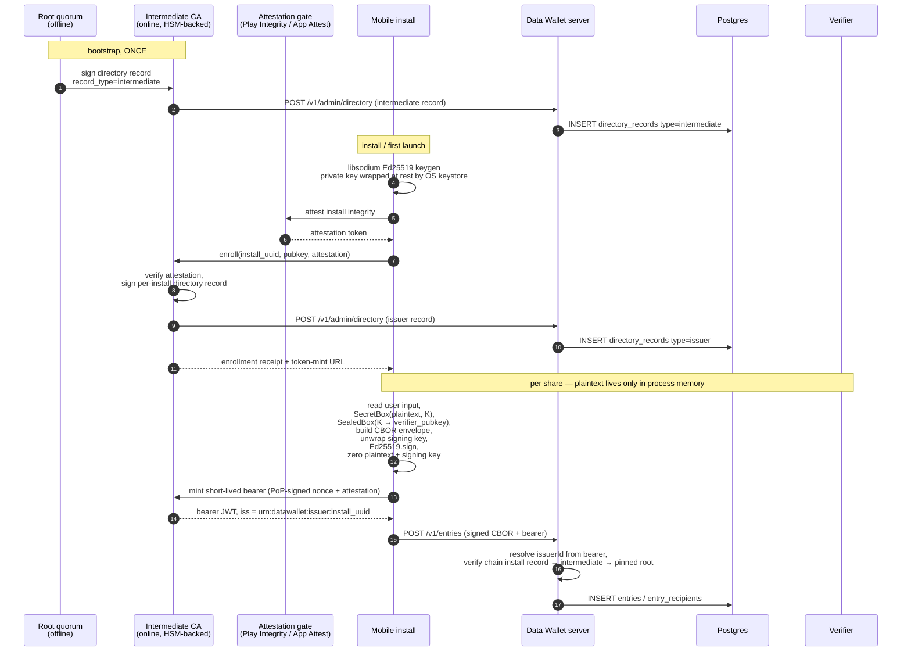
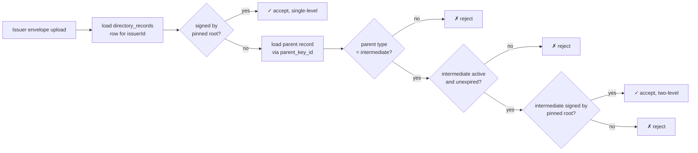
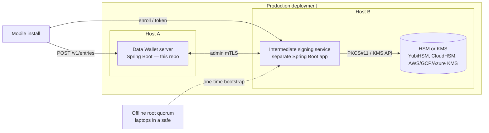

# Further work: per-install mobile-app issuers

**Status:** design proposal, not implemented. Out of scope for v1
([`docs/specs/plan.md`][plan]).
**Audience:** anyone planning the next architectural increment after
the v1 pilot.
**Scope:** how to extend Data Wallet so that every install of a
mobile app acts as its own issuer, without compromising the offline
root quorum or breaking any of v1's hard rules.

[plan]: ../specs/plan.md

## Why this is hard

The v1 trust model puts every issuer's blessing on a directory record
**signed by the offline root quorum** (see
[`docs/terminology.md`][term] § Pinned root quorum and
[`docs/how-to/issuer-in-prod.md`][prod]). That works when issuers are
a small, slow-moving population — a handful of organizational
identities created by hand in a quorum ceremony.

The moment "every install of a mobile app is its own issuer" enters
the requirements, the cost model breaks:

- The number of issuer identities is now **per device**, not per
  organization. Tens of thousands of phones means tens of thousands
  of directory records.
- Every onboarding requires a quorum-blessed signature. The quorum
  is offline by design; you cannot bring it online for every new
  install.
- Every install must hold its own Ed25519 signing key, and the
  product constraints add three more rules:
  1. The private key never leaves the phone.
  2. No plaintext payload is ever stored on the phone or sent to the
     server.
  3. The private key is never stored in plaintext at rest, even
     locally on the phone.

[term]: ../terminology.md
[prod]: ../how-to/issuer-in-prod.md

## Why the obvious shortcuts don't work

| Shortcut | Why it fails the constraints |
|---|---|
| One shared issuer key embedded in the app binary | Per-install attribution lost; binary extraction yields a master forgery key |
| Server signs envelopes on the user's behalf | Plaintext exists on the server; private key not on phone — fails rule 1 and rule 2 |
| Phone uploads plaintext over TLS, server encrypts | Plaintext on the wire to the server — fails rule 2 |
| Bring the root quorum online for enrollment | Defeats the entire trust-model premise; one enrollment-service compromise == quorum compromise |
| Pre-generate a pool of root-blessed issuer slots | Slot pubkeys must be known at signing time; per-install pubkeys are not |

The only architecture that fits is to **insert one delegated layer**
between the offline root quorum and the per-install identities. The
root quorum signs that delegate once; the delegate signs per-install
records online.

## The proposed architecture in one diagram



Two pieces do all the work:

1. **Root-blessed online intermediate.** The root quorum signs **once,
   offline**, the intermediate's directory record. The intermediate
   then runs as an online service with its signing key in an HSM. It
   alone takes the firehose of install enrollments. The root quorum
   never comes online for routine operations — only for bootstrap,
   intermediate rotation, or intermediate compromise.

2. **On-device key custody with no plaintext at rest.** The install
   generates its libsodium Ed25519 keypair locally. The private key is
   wrapped at rest under a key that lives in the OS keystore (iOS
   Keychain `kSecAttrAccessibleWhenUnlockedThisDeviceOnly`; Android
   Keystore, StrongBox where available). The wrapping key never
   leaves the keystore. At sign time the install unwraps to memory,
   signs, zeroes the plaintext key bytes. Same shape as the verifier
   private-key wrapping the codebase already uses for Argon2id-derived
   KEKs (`crypto/SecretBox.java`), but the KEK handle is held by the
   OS instead of being derived from a passphrase.

## How v1 hard rules are preserved

- **"Crypto sources: libsodium only."** Ed25519 keygen and signing
  remain libsodium. The OS keystore protects only the *wrapping* key,
  never the signing key directly.
- **"Signed payloads are canonical CBOR bytes; never re-serialized."**
  Every per-install directory record and every envelope is built once
  on-device, signed once, and stored byte-identical on the server.
- **"AuditService is an interface" / "IssuerPrincipalResolver is an
  interface."** The new bearer-based principal resolver is a third
  implementation of an existing interface; no controller code changes.
- **Two Postgres roles unchanged.** The intermediate uses admin mTLS
  to publish records via `/v1/admin/directory` like any other operator.

## What changes in this codebase

This is a real architectural addition. None of it exists in v1.

### 1. Two-level directory chain

`DirectoryRecordVerifier` currently checks one signature against
`pinned_root_history`. Extend it to walk a chain:

- `record_type='intermediate'` rows: signed by the pinned root quorum.
- `record_type='issuer'` rows: signed by an `intermediate` whose
  record is currently `active` and unexpired.



**Schema change:** new migration
`V8__directory_record_chain.sql` adding:

- `parent_key_id BYTEA NULL` to `directory_records` (NULL means
  signed directly by the pinned root, preserving v1 behaviour).
- Allow `record_type='intermediate'` as a CHECK constraint value.

**Code change:** `DirectoryRecordVerifier` resolves
`signed_record` → if `parent_key_id` is non-NULL, look up the
parent row and verify the issuer record's signature against the
parent's pubkey, then recurse into verifying the parent.

Single-level v1 records continue to verify with no behavioural
change because their `parent_key_id` is NULL.

### 2. New `IssuerPrincipalResolver` for attestation-bearer auth

mTLS at the scale of "every phone has its own client cert" is
operationally painful — every install handshake requires a
per-install cert mint, and Flutter's TLS stack does not expose
keystore-protected client-cert keys without platform channels.

Easier path: implement a third `IssuerPrincipalResolver`
(alongside `X509IssuerPrincipalResolver` and the test stub) that
reads an attestation-bearer token. The token is a JWT signed by
the intermediate, payload includes:

- `iss = urn:datawallet:issuer:<install_uuid>`
- `aud = urn:datawallet:server`
- `exp` short (e.g. 5 minutes)
- `cnf.jkt` JWK thumbprint of the install's Ed25519 pubkey
- `nonce` proof-of-possession (server-rotating to prevent replay)

The resolver verifies the JWT signature against the active
intermediate's pubkey from `directory_records`, parses the
issuer UUID from `iss`, and binds it to the request. The
controller's existing `EntryIngestService.java:43` check
(`envelope.issuerId().equals(issuerPrincipal)`) catches any
attempt to upload an envelope under a different install's
identity.

Selection happens at config time:

```yaml
# application-mobile.yml
datawallet:
  security:
    issuer-mtls: false
    issuer-bearer: true
    issuer-bearer-audience: urn:datawallet:server
```

The mTLS path remains for admin endpoints and for backend issuers
that prefer cert-based auth.

### 3. Intermediate signing service

A separate Spring application (not in the Data Wallet server JAR)
running on its own host with its signing key in an HSM. Endpoints:

| Endpoint | Purpose |
|---|---|
| `POST /enroll` | Verify attestation, sign per-install directory record, push to `/v1/admin/directory`, return enrollment receipt |
| `POST /token` | Verify attestation + PoP nonce signature, issue short-lived issuer bearer JWT |
| `POST /revoke` | Operator endpoint to mark an install's directory record `revoked` |
| `GET /healthz` | Liveness for the operator |

This service authenticates to the Data Wallet server via admin mTLS
just like any human operator running `sign-directory` in v1. From
the server's point of view, it is *one admin client* publishing
many records; that's why no v1 admin code needs to change.

#### Three distinct layers — do not conflate

"HSM-backed intermediate" is shorthand for **three separate
components**. Confusing them is the most common source of
misunderstanding when reading this section.



| Layer | What it is | What it does |
|---|---|---|
| **Data Wallet server** (this repo) | The existing Spring Boot app | Knows nothing about an HSM. Still only sees admin-mTLS clients posting CBOR to `/v1/admin/directory`. From its point of view the intermediate is just *one operator* that publishes a lot of records. |
| **Intermediate signing service** | A *separate* Spring Boot deployable on a *different* host, with its own config and lifecycle | Hosts the enrollment, attestation, and bearer-JWT mint endpoints. Has no Postgres role in the Data Wallet database; talks to the server over the same admin-mTLS surface a human operator would use. |
| **HSM or KMS** | Hardware (or a managed service that emulates it) | Holds the intermediate's Ed25519 private signing key. The intermediate calls out to it via PKCS#11, KMIP, AWS KMS / CloudHSM API, GCP KMS, Azure Key Vault, etc. The private key never appears in the intermediate process's memory. |

**Why the intermediate must be a separate application:**

- **Different blast radius.** A bug in the Data Wallet server (CBOR
  parsing, audit chain, rate limits) must not give an attacker the
  ability to mint issuer records. Two processes, two attack surfaces,
  two sets of credentials.
- **Different uptime profile.** The intermediate is the bottleneck
  for *new install enrollment*. The Data Wallet server is the hot
  path for *every share*. Scale, deploy, and roll back them
  independently.
- **Different auth posture.** The intermediate authenticates *to* the
  Data Wallet server with admin mTLS. Merging the two would dissolve
  that boundary — admin-client code becomes a private method call,
  and the audit story collapses.
- **Different code velocity.** Attestation libraries (Play Integrity,
  App Attest) update frequently and bring in heavy dependencies. Do
  not pull that into the Data Wallet server's classpath.
- **Different operators.** A security team may own the HSM
  credentials and operate the intermediate; a platform team may own
  the Data Wallet server. Independent deploy gates.

**Why the HSM is not the same as the intermediate.**
The intermediate is *application code* — controllers, attestation
clients, JWT signing logic, retry policies. The HSM is a *crypto
oracle* — accept signing requests, return signatures, full stop.
The intermediate decides *what* to sign and *when*; the HSM only
refuses-or-signs based on whatever access policy is loaded into it.
This split lets you swap HSM vendors (YubiHSM in dev → AWS CloudHSM
in staging → on-prem cluster in prod) without touching the
intermediate's business logic, as long as you stay behind PKCS#11
or the cloud-SDK abstraction.

**HSM choice spectrum** (cheapest to strongest):

1. **Software keystore** (key encrypted on disk, decryption key in
   env var) — fine for dev, **never for prod**. Anyone with disk +
   env read access wins.
2. **Cloud KMS** (AWS KMS, GCP KMS, Azure Key Vault) with the
   signing key marked non-exportable — typical production sweet
   spot. Hardware-protected, IAM-gated `Sign` calls, low operational
   overhead, audit trail via cloud-provider logs.
3. **Cloud-managed HSM** (AWS CloudHSM, GCP Cloud HSM, Azure
   Dedicated HSM) — single-tenant, FIPS 140-2 Level 3, more
   expensive, more control.
4. **On-prem HSM** (Thales, Utimaco, YubiHSM 2 cluster) — physically
   yours, hardest to compromise, hardest to operate.

For "every install of a mobile app is its own issuer", #2 is the
typical choice. Make it a config knob in the intermediate so you
can move along this spectrum without code changes.

### 4. Flutter issuer codec

Today only the Java CLI builds envelopes
(`cli/BuildEnvelopeCommand.java`,
`cli/ShareWithVerifierCommand.java`). The Flutter side has no
issuer surface at all (only verifier login + list + open).

New Flutter modules under `client/lib/src/`:

- `issuer/keystore.dart` — Ed25519 keypair generation,
  OS-keystore-backed wrapping, sign-and-zero helper.
- `issuer/enrollment.dart` — attestation client, `POST /enroll`,
  receipt persistence.
- `issuer/bearer.dart` — bearer JWT mint cache + refresh.
- `envelope/builder.dart` — symmetric counterpart of the Java
  `BuildEnvelopeCommand`. Must produce byte-identical output for
  every cross-stack fixture.
- `screens/share_screen.dart` — UI for picking a verifier,
  composing a payload, and submitting.

### 5. Cross-stack fixture extension

`spec/fixtures/` and `spec/tools/gen.py` extend with:

- `intermediate-record/` — sample two-level directory chains.
- `mobile-envelope/` — envelopes built by Flutter, verified by
  the Java CLI (and vice-versa). Locks byte equality across the
  enrollment + signing flow.

Per the v1 hard rule
([`CLAUDE.md`][claude]), if Java and Flutter produce different
bytes the codec is wrong — never patch around it.

[claude]: ../../CLAUDE.md

### 6. Plaintext-never-at-rest invariants in Flutter

Hard rules to enforce in the new issuer flow, audited at code
review:

- Plaintext input is held only in widget state for the duration
  of one share. Cleared on screen pop, on app background, on idle
  timeout. Use widgets that zero their `TextEditingController`s.
- The wrapped private key is read from disk → unwrapped →
  used → zeroed in a single function. No long-lived `Uint8List`
  of secret bytes. Match the Java CLI pattern in
  `cli/RegisterVerifierCommand.java:86-89`:
  `Arrays.fill(keyBytes, (byte) 0)` after every use.
- No analytics, no crash reporting that captures form fields. No
  `SharedPreferences` writes containing user data.
- Only encrypted-at-rest local cache: envelope CBOR (already
  encrypted) and fetched directory records (public).
- Logout / app-uninstall cleanup must purge the wrapped key blob
  *and* call the keystore to delete the KEK handle, otherwise
  re-install on the same device could re-decrypt. Add a teardown
  test that proves both are gone.

## Revocation and rotation

Routine churn touches only the intermediate; the expensive root
quorum ceremony is reserved for two events: initial bootstrap and
intermediate compromise.

| Lever | Effect | Latency |
|---|---|---|
| Phone wipes data / uninstalls | Wrapped blob and KEK handle deleted; install can never sign again | Instant on-device. Server-side records remain valid until revoked |
| Intermediate marks one issuer record `revoked` | Server rejects further envelopes from that install; existing entries still verify under the historical record | One DB write |
| Intermediate revokes a bearer token | Forwards to a deny-list / short token TTL — install must re-attest to mint a new one | ≤ token TTL |
| Root quorum revokes the intermediate (`sign-root-update` + new intermediate record) | All per-install records under that intermediate fail chain validation; you reissue under the new intermediate | Quorum ceremony — hours, not minutes |
| Lost phone | User logs into account-management surface; intermediate marks the install's issuer record `revoked`. No quorum involved | One DB write |

## Residual risks (be explicit)

- **The intermediate is a high-value online target.** If it is
  compromised, the attacker can mint issuer records that look
  legitimate to the server until the root quorum performs a
  `sign-root-update`. HSM-backed keys, attested-only signing
  requests, audit logging of every mint, and rate limits are the
  standard mitigations. The root quorum stays clean — *that is the
  whole point of the split*.
- **Attestation can be bypassed on jailbroken / rooted devices.**
  Play Integrity and App Attest are best-effort. They raise the bar
  but do not eliminate device-level attackers. If the threat model
  includes "user willingly compromises their own device to forge
  envelopes from their install", attestation does not help — but
  neither does any other client-side scheme.
- **"Private key never leaves the phone" is only as strong as the
  OS keystore.** A shipped exploit against the platform keystore can
  exfiltrate the wrapped key. Hardware-backed keys (StrongBox,
  Secure Enclave) raise this bar substantially; pure-software
  keystores do not.
- **`directory_records` grows linearly with installs.** Irrelevant
  at 10⁴ installs, painful at 10⁷. Worth flagging now: partition
  by `issued_at`, or split into an `issuer_records` table with
  periodic archival of revoked rows. Defer until the numbers
  warrant it.
- **Forensics get harder.** A compromised install can sign anything
  its user could sign; with one issuer per install there is no
  shared issuer to revoke, only the one install. That is the right
  answer for user-level provenance, but abuse handling must operate
  per-install, not in bulk.
- **Cross-device account migration is a separate problem.** If the
  user replaces their phone, the new install has a new issuer
  identity. Linking "same human, two installs" is application-level
  work outside this design — Data Wallet's server has no concept of
  "user above install".

## Suggested incremental rollout

A single PR for this is too big. Sequencing that lets each step ship
and be reviewed:

1. **Schema + verifier chain.** `V8__directory_record_chain.sql`,
   `DirectoryRecordVerifier` walks chain, fixtures extended with
   two-level intermediate. v1 records still verify; no behavioural
   change for existing tests.
2. **Bearer principal resolver.** `BearerIssuerPrincipalResolver`
   plus the `application-mobile.yml` profile. Behind a config flag,
   off by default. Integration tests use a stub intermediate signer.
3. **Intermediate service skeleton.** Separate Spring app, no
   attestation yet — signed by a developer-only intermediate key,
   for end-to-end wiring tests.
4. **Attestation integration.** Wire Play Integrity / App Attest
   into the intermediate service. Behind a feature flag so the
   service can run in "dev attestation" mode for local testing.
5. **Flutter issuer codec + fixtures.** Build the on-device
   keypair / wrapping / envelope-builder, lock byte-equality with
   the Java side via the cross-stack fixture suite.
6. **Flutter share UI.** Compose-and-share screen, plaintext-never-
   at-rest invariants, teardown tests.
7. **Production rollout.** Real intermediate HSM keys, root quorum
   bootstrap ceremony for the production intermediate, rate limits,
   per-install enrollment quotas.

Each step lands behind a config flag where possible, so a regression
in step *n* does not break step *n−1*.

## What this proposal does **not** cover

- **OPAQUE / aPAKE** for verifier login — separate v1 out-of-scope
  item, see [`docs/specs/plan.md`][plan].
- **Multi-active signing keys per install** — design assumes one
  active key at a time; rotation is "revoke old, enroll new".
- **Push notifications / streaming uploads** — orthogonal.
- **Cross-device account migration** — application-level concern,
  not in this layer.
- **Threshold signing on-device** (FROST/MuSig2) — not needed; the
  install is a single-key signer.

## See also

- [`docs/terminology.md`](../terminology.md) § Pinned root quorum
- [`docs/how-to/issuer-in-prod.md`](../how-to/issuer-in-prod.md) —
  current single-level issuer flow this proposal extends
- [`docs/explanation/trust-model.md`](../explanation/trust-model.md)
  — design rationale for the offline-root split
- [`docs/specs/crypto-formats.md`](../specs/crypto-formats.md) —
  byte layouts that the chain extension must preserve
- [`docs/specs/plan.md`](../specs/plan.md) § Out of Scope —
  v1 deferrals this proposal would partially close
