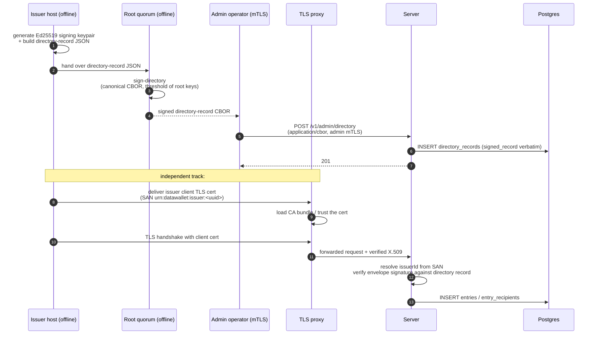
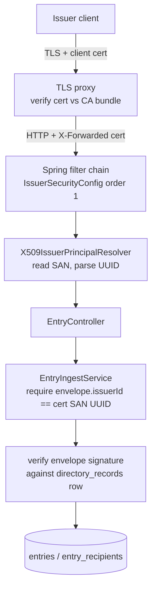

# How to create an issuer in production

**Audience:** operators bringing a new issuer onto a production
Data Wallet deployment.
**Goal:** mint a new issuer identity, get it accepted by the server,
and verify a first signed envelope round-trips end to end.

In dev, [`init-dev-trust`][init-cmd] collapses every step below into
a single command. Production has no such shortcut: an issuer is
created by signing a directory record with the **offline root
quorum**, publishing it to the server, and **independently**
provisioning a client TLS certificate at the TLS-terminating proxy.

There is no `POST /v1/issuers/register`. Issuers are minted by the
root quorum, not by the server.

[init-cmd]: ../../src/main/java/com/erikromson/datawallet/cli/InitDevTrustCommand.java

## Prerequisites

- A pinned root quorum already exists. It was created by
  [`gen-root`][gen-root] at trust-bootstrap time and its public bytes
  are loaded into `pinned_root_history` (see migration
  [`V7__pinned_root_history.sql`][v7]).
- Quorum private keys are available offline (split among the operators
  who hold them).
- An admin operator with mTLS access to `/v1/admin/**`.
- A TLS-terminating proxy (nginx/Envoy/etc.) in front of the Spring
  app.
- A CA you control that signs issuer client certificates.

[gen-root]: ../../src/main/java/com/erikromson/datawallet/cli/GenRootCommand.java
[v7]: ../../src/main/resources/db/migration/V7__pinned_root_history.sql

## The five-step diagram



The flow has two independent tracks that must both succeed for an
issuer to upload envelopes:

1. **Cryptographic identity** (steps 1–4): a directory record signed
   by the root quorum is persisted in `directory_records`.
2. **Transport identity** (steps 5–6): a client TLS cert with a
   matching SAN is trusted by the TLS-terminating proxy.

Compromising either alone is not enough to forge envelopes — an
attacker would need the issuer's **mTLS private key *and*** its
**Ed25519 envelope-signing key**.

## Actors

- **Issuer host (offline).** Generates two unrelated keys: an Ed25519
  envelope-signing keypair, and an mTLS client keypair (X.509). Both
  private keys stay on this host.
- **Root quorum (offline).** Holds the root signing keys created by
  `gen-root`. Signs directory records that bless new issuers.
- **Admin operator.** Connects to the server with admin mTLS and
  publishes signed directory records via `/v1/admin/directory`.
- **TLS-terminating proxy.** Enforces mTLS on issuer paths
  (`/v1/entries/**`, `/v1/issuers/**`) and forwards verified
  certificates to the Spring app.
- **Server.** Authenticates issuers via the SAN URI, validates
  envelope signatures against the directory, and persists envelopes.
- **Postgres.** Stores the signed directory record verbatim plus all
  ingested entries.

## Step 1 — Issuer: generate Ed25519 signing keypair and draft record

On the issuer host (or whatever offline machine the issuer team
owns), generate a libsodium Ed25519 keypair locally. The private key
never leaves that host. Pick:

- a `subject_id` (UUID) — this is the issuer's stable identity
- a `key_id` (16 random bytes) — identifies this specific signing key
- `valid_from` / `valid_until` (UTC ms since epoch)

Build a directory-record JSON template containing the public key,
key ID, validity window, and any metadata. The exact byte layout is
in [`docs/specs/crypto-formats.md`][cf].

[cf]: ../specs/crypto-formats.md

## Step 2 — Root quorum: sign the directory record

Move the JSON template to the offline quorum machine. Sign it with
the required threshold of root private keys:

```sh
bin/cli.sh sign-directory \
  --root-priv root1.privkey.box --root-priv root2.privkey.box \
  --pinned-root pinned-root.cbor \
  --in issuer-acme.json \
  --out issuer-acme.cbor
```

Source: [`SignDirectoryRecordCommand.java`][sdr]. Output is canonical
CBOR — the **same bytes** that will be wire bytes and DB bytes (the
"never re-serialize" rule from [`CLAUDE.md`][claude]).

[sdr]: ../../src/main/java/com/erikromson/datawallet/cli/SignDirectoryRecordCommand.java
[claude]: ../../CLAUDE.md

## Step 3 — Operator: publish the signed record to the server

Hand the signed CBOR to an admin operator. The operator POSTs it to
the server using admin mTLS:

```sh
curl --cert admin.crt --key admin.key \
     --data-binary @issuer-acme.cbor \
     -H 'Content-Type: application/cbor' \
     https://wallet.example.com/v1/admin/directory
```

Server-side, [`AdminDirectoryController`][adc] (`api/admin/AdminDirectoryController.java:51`):

- verifies the root signature against the current `pinned_root_history`
- enforces monotonicity vs. any prior record for
  `(record_type, subject_id, key_id)`
- inserts a row in `directory_records`

[adc]: ../../src/main/java/com/erikromson/datawallet/api/admin/AdminDirectoryController.java

## What lands in the database

`directory_records` schema ([`V1__init.sql:43`][v1]):

| Column | Holds |
|---|---|
| `record_type` | `"issuer"` |
| `subject_id` | issuer UUID |
| `key_id` | 16-byte issuer-key ID |
| `status` | `active` / `revoked` |
| `valid_from`, `valid_until`, `issued_at` | timestamps |
| `root_key_id` | which root quorum key signed this record |
| `signed_record` | canonical CBOR bytes verbatim |

Primary key `(record_type, subject_id, key_id)` — rotating an issuer
key inserts a new row. The signed bytes the root produced are exactly
the bytes the server stores; on every envelope upload the server
re-verifies the root signature on `signed_record` against
`pinned_root_history`.

What is **not** in the DB:

- The issuer's Ed25519 **private signing key** — only on the issuer's
  host.
- The issuer's **mTLS client cert / private key** — trusted by the
  proxy, not stored in Postgres.

[v1]: ../../src/main/resources/db/migration/V1__init.sql

## Step 4 — TLS proxy: trust the issuer's client certificate

Independently of the directory record, the issuer's mTLS client
certificate must be loaded into the TLS-terminating proxy's CA bundle
or allow-list. The certificate **must** carry a `subjectAltName` URI
of the form:

```
urn:datawallet:issuer:<subject_id-uuid>
```

The UUID has to equal the `subject_id` used in Step 1. Spring picks
the cert up via the standard `jakarta.servlet.request.X509Certificate`
request attribute that the proxy populates.

How this flows on every issuer request:



Key code paths:

- [`IssuerSecurityConfig.java:22`][isc] — Spring Security chain at
  order 1 matching `/v1/entries/**` and `/v1/issuers/**`, gated by
  `datawallet.security.issuer-mtls=true` (production default).
- [`X509IssuerPrincipalResolver.java`][xres] — extracts the issuer
  UUID from the client cert's `subjectAlternativeNames` URI. Returns
  `Optional.empty()` for missing cert / wrong prefix / malformed
  UUID, which the controller treats as 401.
- [`EntryIngestService.java:43`][eis] — enforces
  `envelope.issuerId().equals(issuerPrincipal)`. The cert proves
  *who's connecting*; the directory-record-resolved Ed25519 signature
  proves *who signed the bytes*. Both must agree.

> **Vestigial CN regex.** `IssuerSecurityConfig:37` configures
> `.x509(...subjectPrincipalRegex("CN=(.*?)(?:,|$)"))` for Spring's
> built-in `Authentication.principal`. The controller doesn't read
> that — it goes through `X509IssuerPrincipalResolver` which reads
> the SAN URI directly. Without the SAN, auth still "succeeds" at
> the Spring chain level but `IssuerPrincipalResolver` returns empty
> and the controller 401s.

[isc]: ../../src/main/java/com/erikromson/datawallet/security/IssuerSecurityConfig.java
[xres]: ../../src/main/java/com/erikromson/datawallet/security/X509IssuerPrincipalResolver.java
[eis]: ../../src/main/java/com/erikromson/datawallet/api/entry/EntryIngestService.java

## Why two independent identities

| Concern | TLS cert | Directory record |
|---|---|---|
| What it proves | who is *connecting* | who *signed* the envelope bytes |
| Where it's verified | TLS proxy + Spring X.509 | `EntryIngestService` envelope verification |
| Where it's stored | proxy CA bundle | `directory_records` table |
| How it's revoked | pull from CA bundle / CRL — instant | DB write to mark `status='revoked'` — audited |
| Compromise impact alone | can connect but every envelope fails signature check | can produce signed envelopes but cannot reach the server |

Forging an envelope requires both the mTLS private key **and** the
Ed25519 signing key. Revocation can be applied at either layer —
fast at the proxy, durable in the DB.

## Verification

After both tracks succeed, the issuer should be able to upload a test
envelope. Re-use the same flow as
[`docs/tutorials/first-share.md`][fs] — but with the production
`--url`, the production directory record from Step 3, the production
issuer client cert from Step 4, and a real verifier registered via
`register-verifier`.

[fs]: ../tutorials/first-share.md

## Rotation and revocation

- **Rotate issuer signing key.** New `key_id`, new directory record,
  new POST to `/v1/admin/directory`. Old row stays present (history
  by primary key).
- **Revoke issuer signing key.** Publish a directory record with
  `status='revoked'` for the existing `(subject_id, key_id)`.
  Envelope signatures referencing that key stop verifying.
- **Revoke mTLS access.** Pull the cert from the proxy's CA bundle
  or add to its CRL. Existing connections will eventually expire;
  new connections fail at TLS handshake. Use this as the
  break-glass control because it does not require a DB write.

## Related

- [`docs/explanation/trust-model.md`](../explanation/trust-model.md)
  — design rationale for the two-key split.
- [`docs/specs/plan.md`](../specs/plan.md) — root quorum lifecycle,
  threat model.
- [`docs/specs/crypto-formats.md`](../specs/crypto-formats.md) —
  byte layout of directory records and envelopes.
- [`docs/reference/cli.md`](../reference/cli.md) — full CLI command
  reference.
