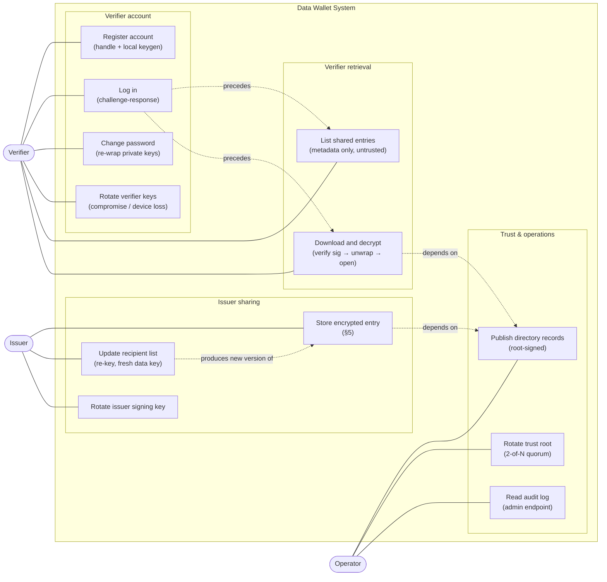

# Data Wallet — plan

A data wallet pilot that lets an issuer deposit a string of its own choosing, encrypt it end-to-end for nominated verifiers, and let those verifiers retrieve it later. The wallet stores ciphertext and wrapped key material only. The verifier must be able to verify cryptographically which issuer created an entry. v1 includes web support, but the web client is lower-assurance than native iOS/Android clients.

## Use cases at a glance

Three actors — Issuer, Verifier, Operator — interact with the wallet through the use cases below. The wallet itself is passive on the payload path: it stores signed envelopes and serves them; it never sees plaintext.



| Use case | Primary actor | Spec section |
|----------|--------------|--------------|
| Register account | Verifier | §6 |
| Log in | Verifier | §7.1 |
| Change password | Verifier | §6, §8 |
| Rotate verifier keys | Verifier | §8 |
| Store encrypted entry | Issuer | §5 |
| Update recipient list | Issuer | §5.9 |
| Rotate issuer signing key | Issuer | §8 |
| List shared entries | Verifier | §7.2 |
| Download and decrypt | Verifier | §7.3 |
| Publish directory records | Operator | §3, §4.3 |
| Rotate trust root | Operator | §3 |
| Read audit log | Operator | §8.1 |

## 1. Threat model and security guarantees

- A wallet or database breach should not expose plaintext strings if verifier private keys remain uncompromised.
- The wallet must not be able to forge issuer authorship without detection. Every shared entry is signed by the issuer and verified by both the wallet on ingest and the verifier client on download.
- The wallet still learns metadata: issuer-verifier graph, timestamps, entry existence, access patterns, and any description left in cleartext.
- Revocation is prospective only. Removing a verifier from an allow-list blocks future fetches but cannot revoke plaintext already downloaded or data keys already obtained.
- Web support is best-effort only. Browser memory, storage, and XSS exposure are weaker than native platform keystore protections.
- Display-name impersonation: UIs rendering `display_name` prominently can let a valid but malicious actor pose as another; identity decisions must bind to stable IDs and fingerprints, not the display field.
- Audit logs are server-visible metadata. They are in-scope for integrity (tamper-evidence) but not for confidentiality beyond what the wallet already sees.

## 2. Actors and identity model

### Actors

- **Issuer** — creates plaintext, encrypts it for selected verifiers, signs the entry envelope, and publishes updates to the recipient list.
- **Wallet** — stores signed encrypted envelopes, verifier account records, and trusted directory records; enforces authentication, signature verification on ingest, and allow-list checks.
- **Verifier** — authenticates to the wallet, verifies issuer signatures, unwraps data keys, and decrypts plaintext locally.

### Identity model

- Each verifier has a stable `verifier_id` UUID used in storage, allow-lists, envelope metadata, and audit logs.
- Each verifier also has a public `handle` used for human lookup. In v1 it should be lowercase ASCII, immutable, and normalized at registration.
- Each verifier may have an optional `display_name` that is changeable, but never used for authentication or access control.
- Each issuer has a stable `issuer_id`, a human-readable `issuer_label`, and one or more signing keys identified by `issuer_signing_key_id`.
- Handles and labels shown in the UI are presentation fields. Access control and cryptographic lookups should use IDs and `key_id` values, not free-text labels.
- Mixed-script and confusable Unicode handles are out of scope for v1. Use a constrained handle format instead of trying to solve homograph safety later.
- UI rule: when identity matters (shared-entry display, recipient confirmation), the UI must render the stable handle and a short key fingerprint alongside any `display_name` or `issuer_label`.

## 3. Keys and trust distribution

- Each verifier client generates two keypairs locally:
  - X25519 encryption keypair used to unwrap per-entry data keys and decrypt shared payloads.
  - Ed25519 authentication keypair used to sign wallet login challenges.
- Each issuer has an Ed25519 signing keypair used to sign shared-entry envelopes. Issuer authenticity always rests on this key; it is independent of the issuer's wallet-login credentials.
- Verifier private keys are wrapped locally with a KEK derived from the verifier password via Argon2id.
- The wallet stores only public keys, wrapped private-key blobs, KDF metadata, and entry metadata. It never stores plaintext private keys or plaintext payloads.
- Directories of verifier public keys and issuer public signing keys are distributed as signed records rooted in an operator-managed offline trust root pinned in clients. A compromised wallet server must not be able to silently substitute keys during lookup.
- Every public key has a `key_id` and a lifecycle status such as `active`, `superseded`, or `revoked`.
- **Wrap authenticity rationale:** data keys are wrapped with `crypto_box_seal`, which provides confidentiality but no sender authentication. Issuer authenticity for the wrapped key and ciphertext comes from the envelope's Ed25519 signature. The verifier client MUST verify the envelope signature against the directory-provided issuer key before treating the data key or plaintext as authentic. See §7.3 for ordering.
- **Trust-root lifecycle:** the offline trust root has a `root_key_id`, `valid_from`, and `valid_until`. Rotation happens via either (a) a client app update that ships a new pinned root, or (b) a signed "root-update" record chained from the old root to the new one, accepted before `valid_until` of the old root. For resilience the root should be a 2-of-N signing quorum (hardware-backed) so a single lost laptop does not brick the pilot.
- **Issuer authentication to the wallet** (skeleton for v1): issuer writes are authenticated by mTLS (issuer client cert issued by the operator CA) plus a request signature using the issuer Ed25519 signing key on the envelope being uploaded. The wallet checks both: mTLS identifies the issuer principal; the envelope signature binds content to the declared `issuer_id`/`issuer_signing_key_id`. See §5.

## 4. Data model

### 4.1 Verifier account record

`{verifier_id, handle, display_name, enc_public_key, enc_key_id, auth_public_key, auth_key_id, wrapped_enc_private_key_blob, wrapped_auth_private_key_blob, kdf_salt, kdf_params, status}`

`kdf_params` carries `{alg:"argon2id", m, t, p, version}`. The wallet rejects records whose parameters are below the published floor (see §6).

### 4.2 Shared entry envelope

`{version, entry_id, issuer_id, issuer_label, issuer_signing_key_id, created_at, description, ciphertext_alg, ciphertext_nonce, ciphertext, ciphertext_hash, recipient_wrappings:[{verifier_id, verifier_key_id, wrapped_data_key}], signature}`

- **Canonical serialization (B1):** envelopes are signed over their deterministic CBOR encoding (RFC 8949 §4.2.1, Core Deterministic Encoding). The signature covers every field listed above except `signature` itself. There are no "server-side indices" in the envelope proper — server indices live in a separate record that is not signed. A `signed_bytes` fixture is shipped with the spec and both Dart and Java stacks must reproduce it byte-for-byte in a cross-stack test.
- **`version`:** `1` in the pilot. Unknown versions MUST be rejected by both wallet and client; there is no "accept all" default.
- **`entry_id`:** UUIDv7 generated by the issuer. It is inside the signed bytes. The wallet enforces uniqueness per `issuer_id`; a collision is rejected, not overwritten.
- **`ciphertext_alg`:** `xsalsa20poly1305` (libsodium `secretbox`) in v1.
- **`ciphertext_nonce`:** 24 random bytes (libsodium `randombytes_buf`). A fresh nonce is required even though the data key is single-use, to avoid relying on the single-use property for security.
- **`description`:** optional, max 256 chars, server-visible cleartext. The creation UI must warn the user that this text is visible to the wallet operator. If in doubt, leave empty.
- **`recipient_wrappings[i].wrapped_data_key`:** output of `crypto_box_seal(data_key, verifier_enc_public_key)`. No separate nonce — sealed boxes derive theirs internally.

### 4.3 Directory record

Directory records bind a subject identity to a public key. Schema:

`{record_type:"verifier"|"issuer", subject_id, key_id, public_key, key_use:"enc"|"auth"|"sign", status:"active"|"superseded"|"revoked", valid_from, valid_until, issued_at, root_key_id, root_signature}`

- Signed by the offline trust root (`root_key_id`). Verified by clients against their pinned root(s).
- **Freshness:** clients MUST reject records older than `issued_at + max_age` (v1: 7 days). The wallet republishes records on rotation and at least every `max_age / 2`. Revocation is expressed by an `active → revoked` status change, not by omission; clients that see a stale `active` record beyond `max_age` treat it as unknown.
- **Signature verification at `created_at`:** when verifying an envelope, clients select the issuer directory record by `issuer_signing_key_id` and require `valid_from ≤ envelope.created_at < valid_until`. This prevents a compromised-then-revoked key from producing valid signatures on forged old-dated entries.

### 4.4 Session token

`{token_id, verifier_id, issued_at, expires_at}` — an opaque random 32-byte identifier stored server-side in a `sessions` table. Lifetime 1 hour; refresh via fresh challenge-response (no refresh tokens in v1). Invalidation is a row delete / status flip in the `sessions` table; `POST /auth/logout` and compromise-triggered invalidation both use the same path. Bearer over TLS in v1; TLS-binding is a follow-up.

### 4.5 Server persistence model

The wallet runs a single PostgreSQL database. All state lives there; v1 does not use object storage or a separate blob store (envelopes are small — a short string plus N ~100-byte wrappings). Schema migrations are managed by Flyway, versioned alongside the envelope `version` field so any future v2 envelope ships with a coordinated migration.

**Storage rule:** signed payloads are persisted as **opaque canonical-CBOR bytes** (`BYTEA`). The server never re-serializes signed data; round-tripping through field columns would risk breaking signatures. Lookup columns next to the blob are denormalized indices, derived from the envelope at ingest, and are not authoritative.

Tables:

```
verifiers(verifier_id PK, handle UNIQUE, display_name,
          enc_public_key, enc_key_id, auth_public_key, auth_key_id,
          wrapped_enc_private_key_blob, wrapped_auth_private_key_blob,
          kdf_salt, kdf_params JSONB, status, created_at, updated_at)

entries(entry_id, version, issuer_id,
        is_current BOOL, created_at, superseded_at NULL,
        signed_envelope BYTEA,         -- canonical CBOR, includes signature
        ciphertext_hash,               -- denormalized for integrity probes
        PRIMARY KEY (entry_id, version),
        INDEX (issuer_id, entry_id))

entry_recipients(entry_id, version, verifier_id, verifier_key_id,
                 PRIMARY KEY (entry_id, version, verifier_id),
                 INDEX (verifier_id))   -- joins to entries WHERE is_current

directory_records(record_type, subject_id, key_id, status,
                  valid_from, valid_until, issued_at,
                  root_key_id, signed_record BYTEA,  -- root-signed CBOR
                  PRIMARY KEY (record_type, subject_id, key_id),
                  INDEX (subject_id, status, valid_from, valid_until))

sessions(token_id PK, verifier_id, issued_at, expires_at, revoked_at NULL,
         INDEX (verifier_id))

audit_log(seq BIGSERIAL PK, ts, event_type, actor_id, entry_id NULL,
          payload JSONB, prev_hash BYTEA, hash BYTEA)
```

- **Envelope versioning and purge:** `(entry_id, version)` is the PK. `is_current = TRUE` on at most one row per `entry_id`. Allow-list updates flip the old row to `is_current = FALSE`, set `superseded_at = now()`, and insert the new version. A scheduled purge job deletes rows where `is_current = FALSE AND superseded_at < now() - INTERVAL '30 days'` (§8) along with their `entry_recipients`.
- **Listing query (§7.2):** `SELECT … FROM entry_recipients r JOIN entries e USING (entry_id, version) WHERE r.verifier_id = :me AND e.is_current` — single-index seek, no scans.
- **Audit append-only enforcement:** the application connects with a role that has `INSERT, SELECT` on `audit_log` only — no `UPDATE`/`DELETE`. A `BEFORE UPDATE OR DELETE` trigger raises an exception as a defense-in-depth check. The hash chain (`hash_n = SHA256(prev_hash || canonical(payload) || ts || event_type || actor_id)`) is computed inside the insert path; the chain head is anchored externally on a documented cadence (out of scope to specify the anchor target in v1, but the operation must be possible).
- **At-rest encryption for metadata:** payloads are E2E-encrypted, but the *metadata* (issuer-verifier graph, descriptions, audit trail) is sensitive. Enable Postgres at-rest encryption via full-disk encryption on the DB host (LUKS or cloud-provider KMS-backed volume encryption). TDE at the column level is not required for v1.
- **Backups and DR:** nightly base backup + WAL streaming for PITR. Retention 30 days. A documented restore drill must be exercised at least once before pilot launch and quarterly thereafter. Backups are encrypted at rest with a separate key from the live DB volume so a compromised live host cannot read backup tarballs.
- **Connection model:** Spring Boot service uses HikariCP. Two roles: `wallet_app` (full DML on operational tables, `INSERT/SELECT` on `audit_log`) and `wallet_admin` (used only for migrations and the admin read endpoint in §8.1).

## 5. Flow A: issuer stores a string

1. Issuer authenticates to the wallet via mTLS (§3).
2. Issuer looks up each verifier by immutable handle and receives a signed directory record containing `verifier_id`, active encryption public key, `enc_key_id`, and directory signature.
3. Issuer verifies the directory record against the pinned trust root.
4. Issuer generates a random data key and encrypts the plaintext once with `secretbox` using a fresh 24-byte random nonce.
5. Issuer wraps the data key once per verifier using that verifier's X25519 public key (`crypto_box_seal`).
6. Issuer builds a shared-entry envelope including issuer metadata, recipient wrappings, ciphertext hash, `entry_id` (UUIDv7), and key versions.
7. Issuer signs the canonical CBOR encoding of the envelope with the issuer Ed25519 signing key.
8. Issuer submits the signed envelope to the wallet. The wallet **MUST**:
   - verify the envelope signature against the directory-held public key for `issuer_signing_key_id`;
   - verify that `issuer_id` matches the authenticated issuer principal (mTLS);
   - verify `issuer_signing_key_id` is `active` for this `issuer_id` in the directory at the current time and that `valid_from ≤ created_at`;
   - verify `entry_id` is unique for this `issuer_id`;
   - verify `version == 1`.
   Only then does it store the envelope and index it by `verifier_id` for each recipient wrapping.
9. **Allow-list updates (B2):** an allow-list change publishes a new entry version with a **fresh data key and re-encrypted ciphertext**, re-signed and re-wrapped for the new recipient set. The plaintext therefore must remain available to the issuer at re-key time (or be re-obtained). Simply rewrapping the old data key is explicitly NOT the v1 model, because removed recipients would retain the key they already had, making the rotation cosmetic. Removing a verifier is still not retroactive for data they already fetched.

## 6. Verifier account creation and login

When a verifier creates an account, it chooses an immutable public handle and an optional display name. The client generates keys locally and the password only protects wrapped private keys; the server never sees the password or plaintext private keys.

Flow:

1. Verifier enters `handle`, optional `display_name`, and password.
2. Client generates an X25519 encryption keypair and an Ed25519 authentication keypair locally.
3. Client derives a KEK from the password with Argon2id using generated `kdf_salt` and chosen `kdf_params`.
4. Client wraps both private keys locally and uploads only the public keys, wrapped blobs, IDs, and KDF metadata.
5. Wallet rejects duplicate handles and rejects records with `kdf_params` below the floor; on success it stores a verifier record keyed by `verifier_id`.
6. On login from a new device, the client fetches the verifier record by handle, derives the KEK locally, and unwraps both private keys in memory.
7. Wrong-password handling happens locally: unwrap fails on the client before any challenge-response auth succeeds.

### Argon2id parameter floor (H2)

- Native (iOS/Android/desktop): `m = 256 MiB, t = 3, p = 1` (libsodium `OPSLIMIT_SENSITIVE`-class).
- Web: `m = 64 MiB, t = 3, p = 1`. Lower because 256 MiB is hostile to mid-range mobile browsers running WASM; this is an explicit trade-off for v1 and is documented as a known reduction in offline-guessing resistance on web-origin records.
- Wallet rejects records below the applicable floor at registration/password-change.
- Password entropy minimum: 12 chars, zxcvbn score ≥ 3, enforced at the client; server rejects if the client signals a weak password in the registration payload (best-effort — the real enforcement is the Argon2id cost).

### Handle-keyed blob retrieval risk (H1)

- **v1 decision:** accepted risk. Wrapped blobs are retrievable by handle, and handles are enumerable, so an attacker can harvest blobs for offline Argon2id guessing. This is mitigated, not closed, by the Argon2id floor above, password-entropy minimums, and rate limiting (§M9).
- **Follow-up (post-pilot):** migrate login to an aPAKE (OPAQUE) so wrapped-blob retrieval requires password knowledge. Tracked in §10.

### Password recovery (M4)

- **v1 decision:** no recovery. A forgotten password means issuing new keypairs, revoking the old ones in the directory, and asking issuers to re-share. This is listed as a known pilot UX limitation.
- A recovery design (e.g., a client-side recovery secret or social recovery) is tracked as a follow-up.

## 7. Verifier retrieval walkthrough

This section narrates what happens on the verifier's device from opening the client to reading a shared string, showing the split between the Flutter client and the wallet server.

### 7.1 Login and session bootstrap

1. Verifier opens the client and enters `handle` + password.
2. Client fetches `{wrapped_enc_private_key_blob, wrapped_auth_private_key_blob, kdf_salt, kdf_params, auth_public_key, auth_key_id, verifier_id}` for that handle.
3. Client derives `KEK = Argon2id(password, kdf_salt, kdf_params)` locally and unwraps both private keys in RAM.
4. Client calls `POST /auth/challenge` with its `verifier_id`.
5. Server returns a fresh random nonce, short-lived (60s) and single-use, bound to that verifier.
6. Client signs the nonce with the Ed25519 auth private key and calls `POST /auth/verify` with `{verifier_id, nonce, signature}`. (`auth_key_id` is not required — the server uses the current active key for the verifier. Multi-active-auth-key is out of scope in v1.)
7. Server verifies the signature against the stored auth public key, inserts a row in the `sessions` table, and returns the opaque session token (§4.4).

### 7.2 Listing shared data

1. Client calls `GET /shared` on an authenticated session.
2. Server finds every entry version whose **current** recipient list contains the logged-in `verifier_id` and returns metadata `[{entry_id, issuer_id, issuer_label, issuer_signing_key_id, created_at, description}, ...]`. Older versions the verifier was on but has since been removed from are not listed. (See §8 for lifecycle.)
3. Client treats issuer metadata in the list as a **hint only** — never authoritative. UIs must not render it in a way that suggests it has been verified. Authority comes only after downloading the envelope and verifying the signature.

### 7.3 Downloading and viewing

1. Verifier selects an entry and the client calls `GET /shared/{entry_id}`.
2. Server re-checks that the current `verifier_id` is present in that entry version's recipient list and returns the signed envelope.
3. Client obtains the issuer directory record for `issuer_signing_key_id` and verifies:
   - the directory record is within its freshness window and `root_signature` verifies against the pinned trust root;
   - `valid_from ≤ envelope.created_at < valid_until` (see §4.3);
   - the envelope signature verifies against the directory public key over the canonical CBOR bytes.
   If any check fails, the client surfaces an error and does NOT unwrap or display plaintext.
4. Client selects the recipient wrapping matching its `verifier_id` and current `enc_key_id`.
5. Client unwraps the data key with its X25519 private key using `crypto_box_seal_open`.
6. Client verifies `ciphertext_hash` matches `sha256(ciphertext)` and decrypts the payload with `secretbox`.
7. Plaintext is displayed in the UI and held in memory only. It is never written to persistent storage.

### 7.4 What the server sees vs. what the verifier sees

| Step | Server sees | Verifier client sees |
|------|-------------|----------------------|
| Login | verifier ID, wrapped blobs in transit, challenge nonce, session token | password, KEK, encryption/auth private keys in RAM |
| List | query by verifier ID | metadata list (treated as untrusted until envelope verification) |
| Download | authorization check, signed envelope in transit | signed envelope -> data key -> plaintext string |

On the payload path, the server is an encrypted-envelope store. It still handles authentication, indexing, ingest verification, and directory distribution, but plaintext exposure is confined to the verifier's device.

## 8. Access control and key lifecycle

- Only the issuer that created an entry may publish new versions or change the recipient list. Enforced at ingest (§5.8) by matching `issuer_id` to the authenticated issuer and verifying the signature.
- Only verifiers present in the **current** recipient list may fetch the latest entry version. Prior versions are retained server-side for 30 days for audit, then purged; they are not served via `GET /shared` or `GET /shared/{entry_id}`.
- Password change means re-wrapping the same verifier private keys with a new KEK and uploading new wrapped blobs and KDF parameters. It is not key rotation.
- Safe login on a new device can reuse the same verifier keypairs if the existing device is not considered compromised.
- Unsafe device loss or verifier compromise requires new keypairs, old-key revocation in the directory, active-session invalidation (delete rows from `sessions` table), and future re-sharing to the new keys.
- Old ciphertext addressed to a revoked verifier key remains decryptable if an attacker already copied the ciphertext or already obtained the old private key.
- `key_id` and key version are first-class throughout directory records, envelopes, audit logs, and recovery flows.
- Issuer signing keys also need versioning. Old signatures remain verifiable against historical issuer public keys even after a newer `issuer_signing_key_id` becomes active, subject to the `valid_from ≤ created_at < valid_until` check in §4.3. A compromised-then-revoked key cannot be used to mint forged old-dated entries because `valid_until` shrinks to the revocation time.

### 8.1 Audit log

- Events logged: issuer ingest (success/fail with reason), verifier login attempts, `GET /shared/{entry_id}` per recipient, allow-list changes, directory record publications, session invalidations.
- Format: append-only table with a hash chain (`hash_n = H(hash_{n-1} || event_n)`) so tampering is detectable by an external checker.
- Retention: 180 days in v1. Access: operator-only, read via an admin endpoint that requires a separate admin principal (not a verifier/issuer session).

## 9. Technology choices

**Server (wallet)**: Java + Spring Boot. Stores verifier records, signed entry envelopes, and trusted directory records. Enforces authentication, ingest signature verification, and allow-list checks. It does not decrypt payloads.

**Client**: Flutter (Dart) across iOS, Android, and web for the pilot. Web is supported, but lower assurance.

**Crypto library**: libsodium everywhere:
- Flutter clients (native and web) → `sodium_libs` — libsodium via FFI on native and WASM on web.
- Java wallet server → `lazysodium-java`.
- Primitive split:
  - Argon2id for password -> KEK (parameter floor in §6)
  - X25519 / `crypto_box_seal` for encrypt-to-verifier
  - Ed25519 / `crypto_sign` for verifier auth challenges and issuer signatures
  - `secretbox` for payload encryption
- CBOR: `cbor` package (Dart) and `jackson-dataformat-cbor` (Java) configured for deterministic encoding (canonical key ordering, shortest-form integers, definite-length maps/arrays). A cross-stack fixture test locks the canonical bytes.

**WASM/web perf note (M12):** Argon2id in WASM at the native floor (`m = 256 MiB`) is too slow on mid-range mobile browsers. The web floor (`m = 64 MiB`) is the per-platform compromise. First-load bundle size for `sodium_libs` on web is ~500 KB gzipped — acceptable but worth lazy-loading off the login path.

**Client storage**:
- Native: `flutter_secure_storage` may cache wrapped private-key blobs only. Plaintext and unwrapped keys never persist.
- Web pilot:
  - Do not persist plaintext or unwrapped keys.
  - Disable service-worker caching for sensitive routes.
  - Server sets `Cache-Control: no-store, no-cache, must-revalidate`, `Pragma: no-cache`, and `Clear-Site-Data: "cache"` on logout responses for sensitive endpoints (`/auth/*`, `/verifiers/{handle}`, `/shared*`).
  - Strict CSP (`default-src 'self'; script-src 'self' 'wasm-unsafe-eval'; object-src 'none'; base-uri 'none'; frame-ancestors 'none'`), `Referrer-Policy: no-referrer`, `Permissions-Policy` denying sensor/camera access, HSTS preload.
  - Prefer fetching wrapped blobs fresh on login rather than storing them in browser storage.
  - Key material is zeroed and dropped from memory on tab visibility loss (`visibilitychange` → `hidden`), explicit logout, and idle timeout (10 min). Re-derivation requires a fresh password entry.

## 10. Tasks

- [ ] Write the threat model and security guarantees into the product spec and API docs.
- [ ] Define verifier identity semantics: `verifier_id`, immutable handle, optional display name.
- [ ] Define trusted directory format, freshness rules, and trust-root rotation (incl. 2-of-N quorum root).
- [ ] Define the verifier account record schema with separate encryption and auth keypairs, wrapped blobs, KDF metadata, and key versions.
- [ ] Define the shared-entry envelope schema with issuer signature, ciphertext hash, recipient wrappings, and `key_id` fields.
- [ ] **Specify canonical serialization (deterministic CBOR) and ship a `signed_bytes` cross-stack fixture test (Dart + Java).**
- [ ] **Define server persistence model (§4.5): PostgreSQL schema for `verifiers`, `entries`, `entry_recipients`, `directory_records`, `sessions`, `audit_log`; signed payloads stored as opaque canonical-CBOR `BYTEA`; Flyway migrations versioned with envelope `version`.**
- [ ] Implement entry-version transition as a transaction: flip old row's `is_current`, set `superseded_at`, insert new version, replace `entry_recipients` rows.
- [ ] Implement scheduled purge job for superseded entry versions older than 30 days (deletes from `entries` and `entry_recipients`).
- [ ] Provision two DB roles: `wallet_app` (DML + audit INSERT/SELECT only) and `wallet_admin` (migrations and admin endpoint); enforce `audit_log` append-only via role grants plus a `BEFORE UPDATE OR DELETE` trigger.
- [ ] Configure at-rest encryption for the DB host (full-disk encryption / KMS-backed volume) and document the key-management process.
- [ ] Configure nightly base backup + WAL streaming PITR with 30-day retention; backups encrypted with a key separate from the live DB volume; document and exercise restore drill before pilot launch.
- [ ] Document operator CA, server TLS cert issuance and rotation, and HSTS preload submission process.
- [ ] Implement verifier account creation: handle selection, client-side key generation, Argon2id KEK derivation, wrapped-blob upload; enforce Argon2id parameter floor server-side.
- [ ] Implement verifier login: fetch wrapped blobs, unwrap keys locally, perform signed challenge-response with the auth key, issue opaque session tokens backed by a server-side `sessions` table with a revocation path.
- [ ] Implement issuer signing keys and verifier-side signature verification for downloaded entries, including the `valid_from ≤ created_at < valid_until` check.
- [ ] **Implement wallet-side envelope signature verification on ingest, with `issuer_id` == authenticated principal and directory-key validity checks.**
- [ ] Implement storage and retrieval APIs keyed by `verifier_id` rather than free-text labels.
- [ ] Implement allow-list updates as new signed entry versions with a fresh data key and re-encrypted ciphertext (not rewrap-only).
- [ ] Implement entry-version lifecycle: latest-only listing, 30-day retention of prior versions, purge job.
- [ ] Implement password change as a private-key re-wrap flow.
- [ ] Implement verifier key rotation and session invalidation for compromise or unsafe device loss.
- [ ] Implement issuer key rotation and historical signature verification bound to `valid_from`/`valid_until`.
- [ ] Implement issuer authentication: mTLS + envelope-signature-as-request-auth; document operator CA issuance process.
- [ ] Implement rate limiting: per-IP and per-handle limits on `/auth/challenge`, `/auth/verify`, `/verifiers/{handle}` lookup, `/shared`, `/shared/{entry_id}`; baseline 5 req/s burst, 60 req/min sustained; exponential backoff on repeated 401.
- [ ] Implement audit log with hash-chained append-only storage, 180-day retention, admin-only read endpoint.
- [ ] Implement web pilot security controls: strict CSP, secure headers, no sensitive response caching, no persistent plaintext, memory-clearing on visibility loss/logout/idle timeout.
- [ ] Document v1 decisions as accepted risks: handle-keyed blob harvesting, no password recovery, server-visible description field. File follow-ups: OPAQUE aPAKE login, recovery design.
- [ ] UI guideline: always show stable handle + key fingerprint alongside any `display_name`/`issuer_label` when identity is load-bearing.
- [ ] Add tests for: canonical CBOR fixture, key substitution, forged issuer entries (rejected on ingest), wrong-password flow, replayed auth challenges, stale allow-list checks, password re-wrap, lost-device recovery, key rotation after compromise, `valid_from`/`valid_until` enforcement on historical envelopes, valid wrapping with invalid signature (must be rejected pre-plaintext), stale directory record rejection, session revocation, rate-limit behavior, web caching/XSS guardrails, and audit-log append-only enforcement (UPDATE/DELETE rejected by trigger and by role grants).
