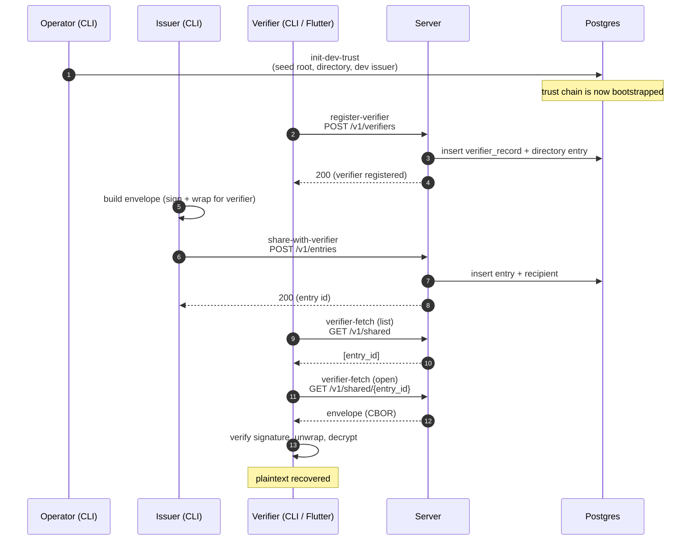
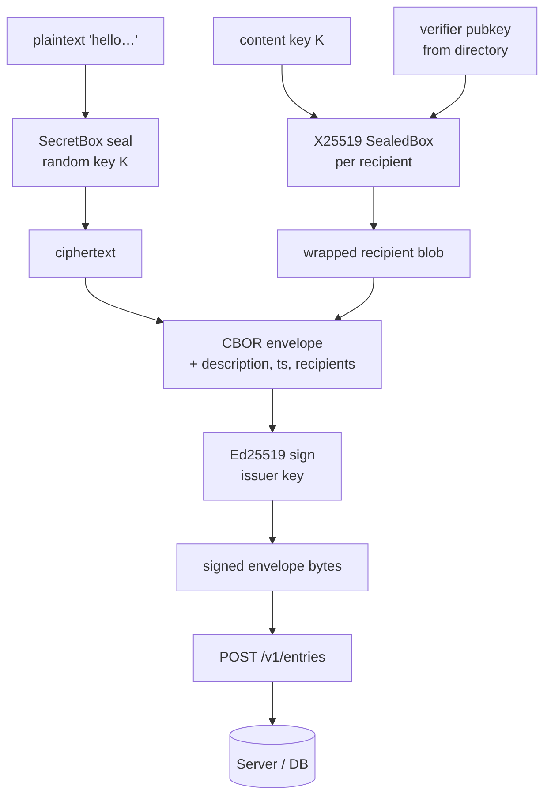

# First share: Issuer → Server → Verifier

**Audience:** developer running the stack for the first time.
**Goal:** in 15 minutes, share a plaintext message from an issuer
through the server to a verifier, and decrypt it back to the original.

You will run five CLI commands. Each one corresponds to one test in
[`bats/happy_path.bats`][hp]; this tutorial is, line for line, an
annotated walkthrough of that test. If any step here fails, the same
step fails in CI.

[hp]: ../../bats/happy_path.bats

## Prerequisites

- Docker Desktop running (Postgres comes up in a container).
- JDK 25 (the project's `pom.xml` pins this; SDKMAN will switch
  automatically via the session-start hook).
- The repo cloned, with you in the project root.

If you're unsure, the BATS suite checks all of this for you in
[`bats/lib/util.bash`][util] under `dw_check_prereqs`.

[util]: ../../bats/lib/util.bash

## The story in one diagram

> **Diagram:** the five-step happy path. Each step is one CLI invocation
> in [`bats/happy_path.bats`][hp].

The actors:

- **Operator (CLI).** Bootstraps the trust chain in dev: generates the
  root quorum keypair, signs the dev directory, and seeds the dev
  issuer identity via `init-dev-trust`. In production this role is an
  offline quorum (see [`specs/plan.md` § Root quorum][plan-root]) —
  the operator never runs against a prod database.
- **Issuer (CLI).** Authors signed envelopes. Holds an Ed25519 signing
  key whose public half is published in a directory record signed by
  the root. In dev the issuer identity is created by `init-dev-trust`
  and lives in `--state-dir`; in prod the issuer's signing key lives
  on its own host and authenticates to the server with mTLS.
- **Verifier (CLI / Flutter).** The end recipient. Owns the X25519
  decryption key and Ed25519 auth key, both wrapped under an
  Argon2id-derived KEK on the verifier's device. The CLI plays this
  role in BATS; in real use it's the Flutter app.
- **Server.** Stateless Spring Boot service. Authenticates issuers
  (mTLS) and verifiers (bearer tokens after challenge/response),
  validates signatures against directory records, and stores the
  signed envelope bytes verbatim. Never sees plaintext or any private
  key.
- **Postgres.** Holds the pinned root, directory records, verifier
  records, entries, recipients, and the audit hash chain. The server
  treats stored envelope bytes as opaque `BYTEA` — wire bytes equal
  signed bytes equal DB bytes.



The rest of this page walks each step.

## Setup

The BATS suite handles setup once per file in `setup_file()`
([`bats/happy_path.bats:26-34`][hp-setup]). To do the same by hand:

```sh
bash bin/start.sh --no-server   # bring Postgres up, build the JAR
rm -rf "$DW_STATE_DIR"          # fresh CLI state
mkdir -p "$DW_STATE_DIR"
bash bin/start.sh               # start the server (separate terminal)
```

Required env vars (all set by [`bats/lib/util.bash`][util] when you
run via BATS):

| Variable | What it is |
|----------|------------|
| `DW_PROJECT_DIR` | repo root |
| `DW_SERVER_URL` | usually `http://localhost:8080` |
| `DW_PG_DB`, `DW_PG_USER`, `DW_PG_PASSWORD` | Postgres connection |
| `DW_STATE_DIR` | where the CLI keeps key material between runs |

[hp-setup]: ../../bats/happy_path.bats#L26-L34

## Step 1 — Operator: bootstrap the trust chain

The first command seeds the root keypair, the directory, and a dev
issuer identity. In production, root and issuer keys come from
elsewhere; in dev, [`InitDevTrustCommand`][init-cmd] does it all in
one shot.

```sh
bash bin/cli.sh init-dev-trust \
    --jdbc-url "jdbc:postgresql://localhost:5432/$DW_PG_DB" \
    --jdbc-user "$DW_PG_USER" \
    --jdbc-password "$DW_PG_PASSWORD" \
    --state-dir "$DW_STATE_DIR" \
    --passphrase "$PASSPHRASE"
```

(Source: [`bats/happy_path.bats:40-46`][hp-step1].)

What it touches:

- Inserts a `pinned_root` row (the trust anchor — see migration
  [`V1__init.sql`][v1] and [`V7__pinned_root_history.sql`][v7]).
- Inserts the dev issuer's directory record, signed by the root.
- Writes the operator's encrypted private keys to `--state-dir`,
  protected by `--passphrase` (Argon2id-derived key).

> **Why `init-dev-trust` is dev-only.** Production roots are signed by
> an offline quorum (see [`specs/plan.md` § Root quorum][plan-root]).
> `init-dev-trust` shortcuts that for local development.

[init-cmd]: ../../src/main/java/com/erikromson/datawallet/cli/InitDevTrustCommand.java
[hp-step1]: ../../bats/happy_path.bats#L40-L46
[v1]: ../../src/main/resources/db/migration/V1__init.sql
[v7]: ../../src/main/resources/db/migration/V7__pinned_root_history.sql
[plan-root]: ../specs/plan.md

## Step 2 — Verifier: register

The verifier creates an account on the server with a handle and a
password. Server-side, [`VerifierController`][vc] persists the
verifier record and a corresponding directory entry signed by the
root.

```sh
bash bin/cli.sh register-verifier \
    --url "$DW_SERVER_URL" \
    --handle happy_alice \
    --password 'happy-password-floor'
```

(Source: [`bats/happy_path.bats:48-54`][hp-step2].)

What happens:

- The CLI generates the verifier's long-term keypair (libsodium —
  never `SecureRandom`; see [`crypto/Random.java`][rnd]).
- Argon2id derives an auth-key from the password
  ([`crypto/Argon2id.java`][argon]).
- POST `/v1/verifiers` with the public keys and login blob (see
  wire format in [`specs/api.md` § Verifier registration][api-vreg]).

> **What's *not* persisted server-side.** The password and the
> private keys never leave the verifier. The server stores only the
> Argon2id parameters, the salt, and the verifier's public keys.
> Threat-model details: [`specs/plan.md` § Verifier auth][plan-vauth].

[vc]: ../../src/main/java/com/erikromson/datawallet/api/verifier/VerifierController.java
[hp-step2]: ../../bats/happy_path.bats#L48-L54
[rnd]: ../../src/main/java/com/erikromson/datawallet/crypto/Random.java
[argon]: ../../src/main/java/com/erikromson/datawallet/crypto/Argon2id.java
[api-vreg]: ../specs/api.md
[plan-vauth]: ../specs/plan.md

## Step 3 — Issuer: share an envelope with the verifier

The headline step. The issuer takes a plaintext, builds a signed
envelope, wraps it for the verifier, and uploads it.

```sh
bash bin/cli.sh share-with-verifier \
    --url "$DW_SERVER_URL" \
    --to happy_alice \
    --plaintext 'hello from the issuer 👋' \
    --description 'happy-path test entry' \
    --jdbc-url "jdbc:postgresql://localhost:5432/$DW_PG_DB" \
    --jdbc-user "$DW_PG_USER" \
    --jdbc-password "$DW_PG_PASSWORD" \
    --state-dir "$DW_STATE_DIR" \
    --passphrase "$PASSPHRASE" \
    --dev
```

(Source: [`bats/happy_path.bats:56-67`][hp-step3].)

There are several distinct things happening — diagram first:

> **Diagram:** envelope construction and upload, expanding step 3.



The wire bytes equal the signed bytes equal the DB `BYTEA` bytes.
[`CLAUDE.md`][claude] calls this out as a hard rule: **never
re-serialize on the server**. The codec is shared between the issuer
CLI and the Flutter verifier — the cross-stack fixture suite under
[`spec/fixtures/`][fixtures] guarantees byte-for-byte equality.

Server-side, [`EntryController`][ec] just authenticates the issuer
(mTLS in production via [`X509IssuerPrincipalResolver`][x509], stub
in dev), validates the signature against the issuer's directory
record, and inserts.

[hp-step3]: ../../bats/happy_path.bats#L56-L67
[claude]: ../../CLAUDE.md
[fixtures]: ../../spec/fixtures/
[ec]: ../../src/main/java/com/erikromson/datawallet/api/entry/EntryController.java
[x509]: ../../src/main/java/com/erikromson/datawallet/security/X509IssuerPrincipalResolver.java

## Step 4 — Verifier: list shared entries

The verifier logs in (challenge / response) and lists the entries
shared with them.

```sh
bash bin/cli.sh verifier-fetch \
    --url "$DW_SERVER_URL" \
    --handle happy_alice \
    --password 'happy-password-floor'
```

(Source: [`bats/happy_path.bats:69-77`][hp-step4].)

The CLI does two things in one invocation:

1. Authenticate. POST `/v1/auth/challenge` → receive a challenge,
   sign it with the auth-key derived from the password, POST
   `/v1/auth/verify`, receive an opaque 32-byte bearer token. (See
   [`auth/AuthController.java`][auth].)
2. Fetch the list. GET `/v1/shared` with the bearer token in
   `Authorization`. Server returns the entry IDs visible to this
   verifier (see [`shared/SharedController.java`][sc]).

The BATS test asserts the output contains a UUID-shaped line:

```bash
assert_line --regexp '^[0-9a-f]{8}-[0-9a-f]{4}-[0-9a-f]{4}-[0-9a-f]{4}-[0-9a-f]{12}$'
```

That's the [UUIDv7][uuid] entry id from
[`crypto/UuidV7.java`][uuidv7] — sortable by creation time, which
matters for the cursor-based listing.

[hp-step4]: ../../bats/happy_path.bats#L69-L77
[auth]: ../../src/main/java/com/erikromson/datawallet/api/auth/AuthController.java
[sc]: ../../src/main/java/com/erikromson/datawallet/api/shared/SharedController.java
[uuid]: https://www.rfc-editor.org/rfc/rfc9562
[uuidv7]: ../../src/main/java/com/erikromson/datawallet/crypto/UuidV7.java

## Step 5 — Verifier: open the entry

Same command, with `--entry-id`. The CLI fetches the envelope CBOR,
verifies the issuer signature, unwraps the content key with its
private key, and decrypts.

```sh
bash bin/cli.sh verifier-fetch \
    --url "$DW_SERVER_URL" \
    --handle happy_alice \
    --password 'happy-password-floor' \
    --entry-id "$entry_id"
```

(Source: [`bats/happy_path.bats:79-94`][hp-step5].)

Output ends with the original plaintext, asserted by:

```bash
assert_output --partial "hello from the issuer 👋"
```

Round trip closed. The plaintext never touched the server in the
clear — the server only stores the signed envelope bytes; the
content key is wrapped to the verifier's X25519 public key and is
unrecoverable without the verifier's private key.

[hp-step5]: ../../bats/happy_path.bats#L79-L94

## What you've verified

- The trust chain bootstraps end to end (step 1).
- The auth flow works (steps 2 and 4): Argon2id + Ed25519 challenge
  / response.
- Envelope construction is correct (step 3): the same bytes that the
  issuer signs are the bytes the server stores and the verifier reads.
- Cross-stack consistency holds: the signed envelope built by the
  Java CLI is opened by either the Java CLI or the Flutter client.

## When this page goes wrong

- A step's link points at a line range that no longer matches:
  the structure of `bats/happy_path.bats` changed. Re-read the test
  and update the line ranges.
- A code-link 404s: a class moved. Update the link.
- The CI suite fails on a step this page describes: the *code*
  regressed; fix the code, not the doc.

The link-freshness CI check from `01-guidelines.md` will catch the
first two automatically.

## Next steps

- **Want to see what's in Postgres after each step?** Run the more
  granular suite: [`bats/end_to_end.bats`](../../bats/end_to_end.bats).
- **Want to add a step?** See `how-to/add-an-endpoint.md` (TODO).
- **Want to understand why the format is what it is?** Read
  [`specs/plan.md`](../specs/plan.md) — design rationale and threat
  model. Wire-format details: [`specs/api.md`](../specs/api.md),
  [`specs/crypto-formats.md`](../specs/crypto-formats.md).
